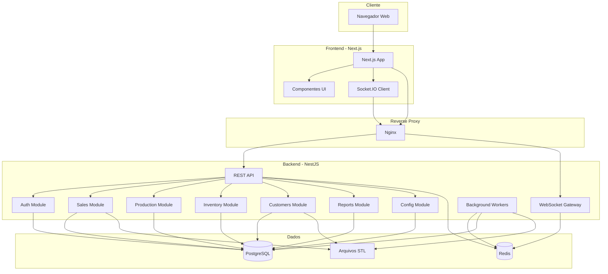
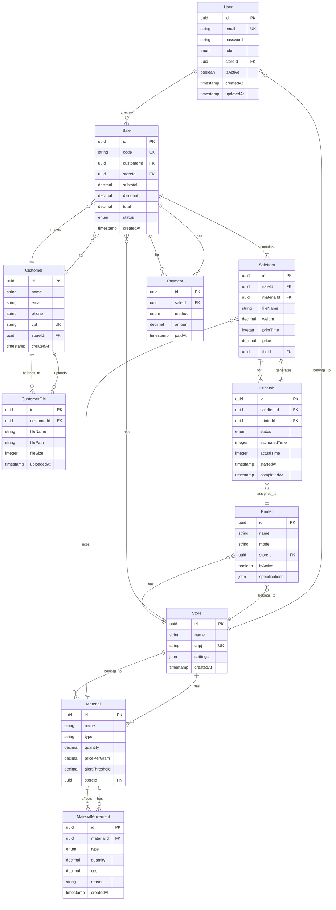
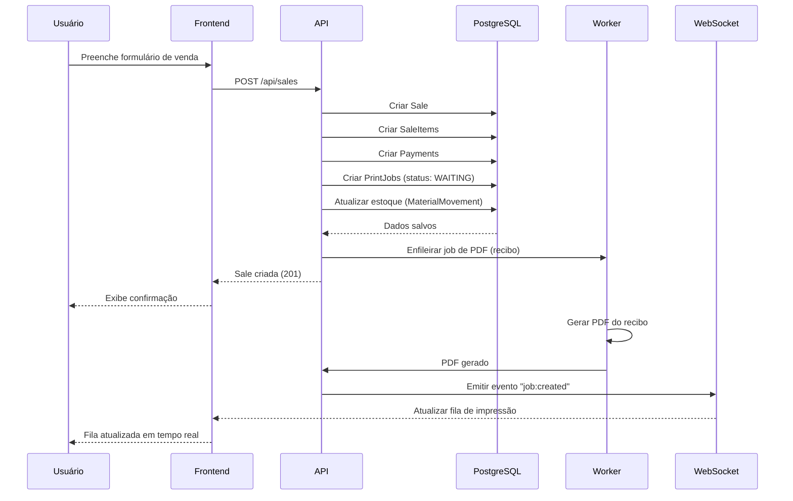
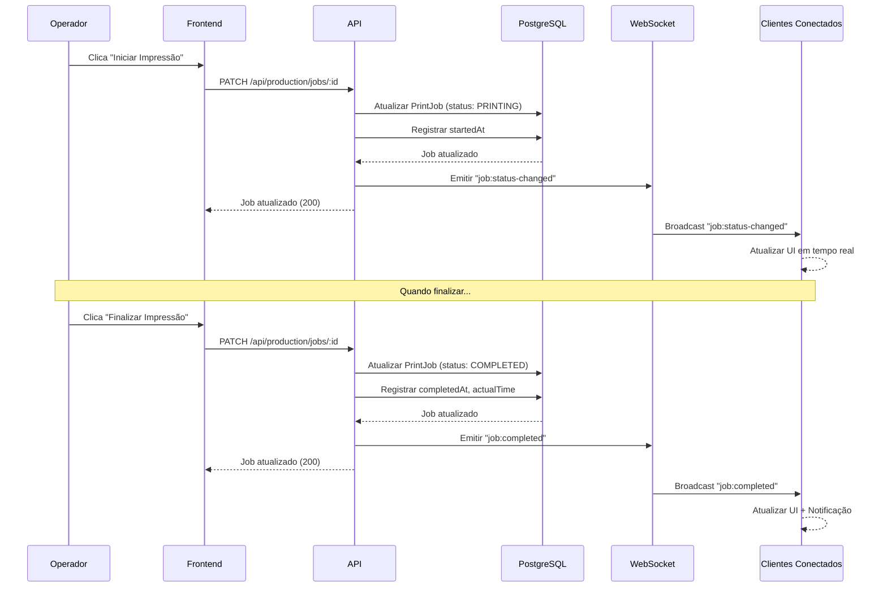
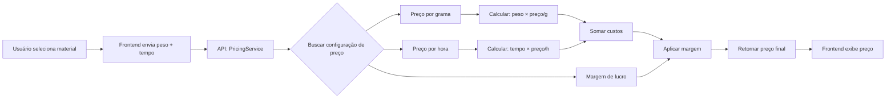
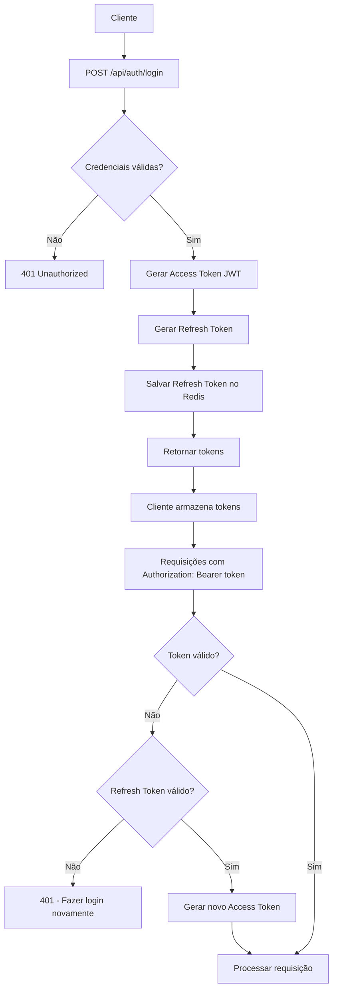
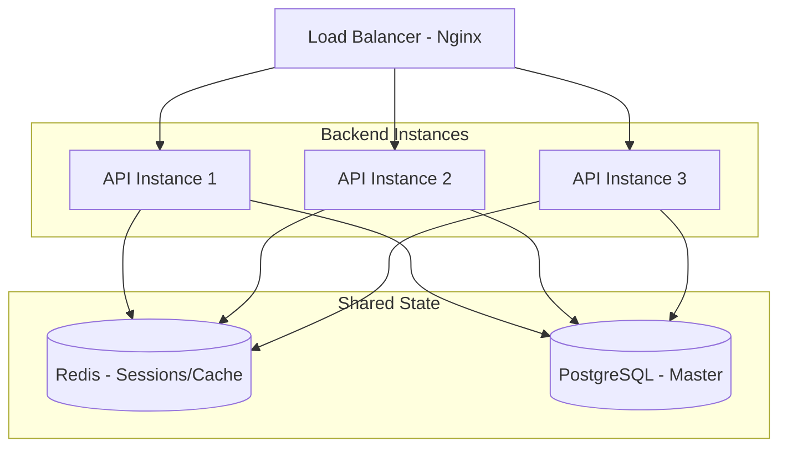

# ImprimiAqui3D - Arquitetura do Sistema

Este documento descreve a arquitetura técnica completa do sistema ImprimiAqui3D.

## 📐 Visão Geral

ImprimiAqui3D é um sistema full-stack para gestão de negócios de impressão 3D, construído com arquitetura moderna e escalável.

### Características Principais

- **Multi-tenant**: Suporte a múltiplas lojas
- **Real-time**: Atualizações em tempo real via WebSocket
- **Modular**: Arquitetura baseada em módulos independentes
- **Escalável**: Preparado para crescimento horizontal
- **Seguro**: Autenticação JWT + RBAC + validações rigorosas

---

## 🏗️ Arquitetura de Alto Nível



---

## 🛠️ Stack Tecnológica

### Frontend

| Tecnologia | Versão | Justificativa |
|------------|--------|---------------|
| **Next.js** | 14+ | Framework React moderno com App Router, SSR, otimizações automáticas |
| **React** | 18+ | Biblioteca UI mais popular, grande ecossistema |
| **TailwindCSS** | 3+ | Utility-first CSS, rápido desenvolvimento, consistência |
| **Socket.IO Client** | 4+ | Real-time bidirecional, fallback automático |
| **Axios** | 1+ | Cliente HTTP com interceptors, retry, timeout |
| **React Hook Form** | 7+ | Formulários performáticos com validação |
| **Zod** | 3+ | Validação type-safe de schemas |
| **Recharts** | 2+ | Gráficos React nativos, customizáveis |

### Backend

| Tecnologia | Versão | Justificativa |
|------------|--------|---------------|
| **NestJS** | 10+ | Framework Node.js enterprise, arquitetura modular, TypeScript nativo |
| **TypeORM** | 0.3+ | ORM completo, migrations, relations, type-safe |
| **PostgreSQL** | 16+ | Banco relacional robusto, ACID, JSON support |
| **Redis** | 7+ | Cache in-memory, pub/sub, filas |
| **Socket.IO** | 4+ | WebSocket com fallback, rooms, namespaces |
| **Bull** | 4+ | Filas de jobs robustas com Redis |
| **Passport** | 0.7+ | Autenticação modular, estratégias JWT |
| **class-validator** | 0.14+ | Validação declarativa com decorators |

### DevOps

| Tecnologia | Versão | Justificativa |
|------------|--------|---------------|
| **Docker** | 24+ | Containerização, ambiente consistente |
| **Docker Compose** | 2+ | Orquestração multi-container |
| **Nginx** | 1.25+ | Reverse proxy, load balancer, SSL termination |

---

## 📦 Arquitetura de Módulos (Backend)

### Estrutura de Pastas

```
backend/src/
├── main.ts                    # Entry point
├── app.module.ts              # Módulo raiz
├── common/                    # Código compartilhado
│   ├── decorators/
│   ├── filters/
│   ├── guards/
│   ├── interceptors/
│   └── pipes/
├── config/                    # Configurações
│   └── database.config.ts
├── database/
│   ├── migrations/
│   └── seeds/
├── auth/                      # Autenticação e autorização
│   ├── auth.controller.ts
│   ├── auth.service.ts
│   ├── auth.module.ts
│   ├── strategies/
│   │   ├── jwt.strategy.ts
│   │   └── refresh.strategy.ts
│   ├── guards/
│   │   ├── jwt-auth.guard.ts
│   │   └── roles.guard.ts
│   ├── decorators/
│   │   └── roles.decorator.ts
│   └── entities/
│       └── user.entity.ts
├── sales/                     # PDV e vendas
│   ├── sales.controller.ts
│   ├── sales.service.ts
│   ├── sales.module.ts
│   ├── services/
│   │   └── pricing.service.ts
│   └── entities/
│       ├── sale.entity.ts
│       ├── sale-item.entity.ts
│       ├── payment.entity.ts
│       └── cash-register.entity.ts
├── production/                # Fila de impressão
│   ├── production.controller.ts
│   ├── production.service.ts
│   ├── production.module.ts
│   ├── gateways/
│   │   └── production.gateway.ts
│   └── entities/
│       ├── print-job.entity.ts
│       ├── printer.entity.ts
│       └── print-history.entity.ts
├── inventory/                 # Estoque de filamentos
│   ├── inventory.controller.ts
│   ├── inventory.service.ts
│   ├── inventory.module.ts
│   └── entities/
│       ├── material.entity.ts
│       ├── material-movement.entity.ts
│       └── material-alert.entity.ts
├── customers/                 # Gestão de clientes
│   ├── customers.controller.ts
│   ├── customers.service.ts
│   ├── customers.module.ts
│   └── entities/
│       ├── customer.entity.ts
│       └── customer-file.entity.ts
├── reports/                   # Relatórios e dashboard
│   ├── reports.controller.ts
│   ├── reports.service.ts
│   ├── reports.module.ts
│   └── services/
│       ├── dashboard.service.ts
│       └── export.service.ts
├── system-config/             # Configurações do sistema
│   ├── config.controller.ts
│   ├── config.service.ts
│   ├── config.module.ts
│   └── entities/
│       ├── system-config.entity.ts
│       ├── material-pricing.entity.ts
│       └── printer-profile.entity.ts
└── workers/                   # Background jobs
    ├── workers.module.ts
    └── processors/
        ├── pdf.processor.ts
        ├── stl.processor.ts
        └── email.processor.ts
```

### Responsabilidades dos Módulos

#### Auth Module
- Login/Logout
- Geração e validação de JWT
- Refresh tokens
- RBAC (Admin, Manager, Operator, Client)
- Gestão de usuários

#### Sales Module
- Criação de orçamentos
- Conversão orçamento → venda
- Cálculo automático de preço
- Múltiplas formas de pagamento
- Controle de caixa
- Emissão de recibos

#### Production Module
- Fila de impressão
- Atribuição a impressoras
- Controle de status (Waiting, Printing, Completed, Failed)
- Tempo estimado vs real
- Notificações em tempo real (WebSocket)

#### Inventory Module
- Controle de estoque de filamentos
- Entrada/saída automática
- Custo médio ponderado
- Alertas de estoque baixo
- Histórico de movimentações

#### Customers Module
- Cadastro de clientes
- Histórico de impressões
- Upload e gestão de arquivos STL
- Programa de fidelização (futuro)

#### Reports Module
- Dashboard com métricas em tempo real
- Faturamento diário/mensal
- Peças mais impressas
- Impressoras mais usadas
- Exportação em PDF/Excel

#### System Config Module
- Configurações de preço (por grama, por hora)
- Perfis de impressora
- Configurações de loja
- Parâmetros do sistema

#### Workers Module
- Geração de PDF (orçamentos/recibos)
- Processamento de arquivos STL (preview/thumbnail)
- Envio de e-mails (futuro)
- Envio de WhatsApp (futuro)

---

## 🗄️ Modelo de Dados

### Diagrama ER (Principais Entidades)



### Principais Relacionamentos

1. **User ↔ Store**: Muitos usuários pertencem a uma loja (multi-tenant)
2. **Sale ↔ Customer**: Venda pertence a um cliente
3. **Sale → SaleItem**: Venda contém múltiplos itens (peças)
4. **SaleItem → PrintJob**: Cada item gera um job de impressão
5. **PrintJob ↔ Printer**: Job é atribuído a uma impressora
6. **Material ↔ MaterialMovement**: Movimentações de estoque

---

## 🔄 Fluxo de Dados

### Fluxo 1: Criar Venda (PDV)



### Fluxo 2: Atualizar Status de Impressão



### Fluxo 3: Cálculo Automático de Preço



**Fórmula:**
```
preço_final = (peso_g × preço_por_grama) + (tempo_h × preço_por_hora) × (1 + margem)
```

---

## 🔐 Segurança

### Autenticação e Autorização



### RBAC (Role-Based Access Control)

| Role | Permissões |
|------|------------|
| **ADMIN** | Acesso total, configurações do sistema, multi-loja |
| **MANAGER** | Gestão da loja, relatórios, configurações de preço |
| **OPERATOR** | PDV, produção, estoque, clientes |
| **CLIENT** | Visualizar histórico próprio, upload de STL |

**Implementação:**

```typescript
// Decorator customizado
@Roles('ADMIN', 'MANAGER')
@UseGuards(JwtAuthGuard, RolesGuard)
@Get('reports/financial')
async getFinancialReport() {
  // Apenas ADMIN e MANAGER podem acessar
}
```

### Validação de Dados

**Camadas de validação:**

1. **Frontend**: React Hook Form + Zod
2. **API**: class-validator (DTOs)
3. **Banco**: Constraints e triggers

**Exemplo:**

```typescript
// DTO com validação
export class CreateSaleDto {
  @IsUUID()
  customerId: string;

  @IsArray()
  @ValidateNested({ each: true })
  @Type(() => SaleItemDto)
  items: SaleItemDto[];

  @IsEnum(PaymentMethod)
  paymentMethod: PaymentMethod;

  @IsNumber()
  @Min(0)
  total: number;
}
```

### Proteção contra Ataques

| Ataque | Proteção |
|--------|----------|
| **SQL Injection** | TypeORM (parametrized queries) |
| **XSS** | Sanitização de inputs, CSP headers |
| **CSRF** | SameSite cookies, CSRF tokens |
| **Rate Limiting** | Throttler (100 req/min por IP) |
| **File Upload** | Validação de tipo, tamanho máximo, scan antivírus (futuro) |
| **Brute Force** | Rate limiting no login, captcha após 3 tentativas |

---

## 🚀 Escalabilidade

### Estratégias de Escala

#### Escala Horizontal (Múltiplas Instâncias)



**Configuração:**
- Redis para sessões compartilhadas
- Socket.IO com Redis Adapter (pub/sub)
- Arquivos STL em storage compartilhado (NFS ou S3)

#### Escala Vertical (Recursos)

- **CPU**: 2 cores → 4 cores → 8 cores
- **RAM**: 4GB → 8GB → 16GB
- **Disco**: HDD → SSD → NVMe

#### Cache Strategy

```typescript
// Cache em múltiplas camadas
@Injectable()
export class ReportsService {
  async getDashboard(storeId: string) {
    // 1. Verificar cache Redis (TTL: 5min)
    const cached = await this.redis.get(`dashboard:${storeId}`);
    if (cached) return JSON.parse(cached);
    
    // 2. Buscar do banco
    const data = await this.calculateDashboard(storeId);
    
    // 3. Salvar no cache
    await this.redis.setex(
      `dashboard:${storeId}`,
      300, // 5 minutos
      JSON.stringify(data)
    );
    
    return data;
  }
}
```

### Otimizações de Performance

1. **Banco de Dados**
   - Índices em colunas frequentemente consultadas
   - Paginação em listagens
   - Eager loading de relações necessárias
   - Materialized views para relatórios complexos

2. **API**
   - Compressão gzip
   - ETags para cache HTTP
   - Lazy loading de módulos
   - Connection pooling

3. **Frontend**
   - Code splitting (Next.js automático)
   - Image optimization (next/image)
   - Prefetching de rotas
   - Memoização de componentes

---

## 🔌 API Design

### Padrões REST

**Convenções:**
- Recursos no plural: `/api/sales`, `/api/customers`
- IDs na URL: `/api/sales/:id`
- Verbos HTTP semânticos:
  - `GET`: Listar/Buscar
  - `POST`: Criar
  - `PATCH`: Atualizar parcialmente
  - `PUT`: Substituir completamente
  - `DELETE`: Remover

**Exemplo de endpoints:**

```
# Sales
GET    /api/sales              # Listar vendas (paginado)
GET    /api/sales/:id          # Buscar venda específica
POST   /api/sales              # Criar venda
PATCH  /api/sales/:id          # Atualizar venda
DELETE /api/sales/:id          # Cancelar venda

# Production
GET    /api/production/jobs    # Listar jobs
GET    /api/production/jobs/:id
POST   /api/production/jobs
PATCH  /api/production/jobs/:id/status
DELETE /api/production/jobs/:id

# Inventory
GET    /api/inventory/materials
POST   /api/inventory/materials
PATCH  /api/inventory/materials/:id
POST   /api/inventory/materials/:id/movement
```

### Respostas Padronizadas

**Sucesso (200-299):**
```json
{
  "data": { ... },
  "meta": {
    "timestamp": "2026-01-26T22:00:00Z",
    "requestId": "uuid"
  }
}
```

**Erro (400-599):**
```json
{
  "error": {
    "code": "VALIDATION_ERROR",
    "message": "Dados inválidos",
    "details": [
      {
        "field": "email",
        "message": "Email inválido"
      }
    ]
  },
  "meta": {
    "timestamp": "2026-01-26T22:00:00Z",
    "requestId": "uuid"
  }
}
```

### Paginação

```
GET /api/sales?page=1&limit=20&sort=createdAt:desc&filter=status:completed
```

**Resposta:**
```json
{
  "data": [...],
  "meta": {
    "page": 1,
    "limit": 20,
    "total": 150,
    "totalPages": 8
  }
}
```

---

## 📡 WebSocket Events

### Namespaces

- `/production`: Eventos de fila de impressão
- `/inventory`: Alertas de estoque
- `/sales`: Atualizações de vendas

### Eventos (Production)

| Evento | Direção | Payload | Descrição |
|--------|---------|---------|-----------|
| `job:created` | Server → Client | `{ job: PrintJob }` | Novo job criado |
| `job:status-changed` | Server → Client | `{ jobId, status, timestamp }` | Status alterado |
| `job:started` | Server → Client | `{ jobId, printerId, startedAt }` | Impressão iniciada |
| `job:completed` | Server → Client | `{ jobId, actualTime, completedAt }` | Impressão finalizada |
| `job:failed` | Server → Client | `{ jobId, reason, failedAt }` | Impressão falhou |
| `subscribe:printer` | Client → Server | `{ printerId }` | Inscrever em impressora |

**Exemplo de uso (Frontend):**

```typescript
const socket = io('http://localhost:3001/production');

socket.on('job:status-changed', (data) => {
  console.log(`Job ${data.jobId} agora está ${data.status}`);
  updateUI(data);
});

socket.emit('subscribe:printer', { printerId: 'uuid' });
```

---

## 🧪 Testes

### Pirâmide de Testes

```
        /\
       /  \
      / E2E \         10% - Testes End-to-End
     /______\
    /        \
   /Integration\      30% - Testes de Integração
  /____________\
 /              \
/  Unit Tests    \    60% - Testes Unitários
/________________\
```

### Estratégia de Testes

**Backend:**
- **Unit**: Services, helpers, utils
- **Integration**: Controllers + Services + DB
- **E2E**: Fluxos completos via HTTP

**Frontend:**
- **Unit**: Hooks, utils, helpers
- **Component**: Componentes isolados
- **E2E**: Fluxos de usuário (Playwright)

---

## 📊 Monitoramento e Observabilidade

### Logs Estruturados

```json
{
  "timestamp": "2026-01-26T22:00:00Z",
  "level": "info",
  "context": "SalesService",
  "message": "Venda criada com sucesso",
  "data": {
    "saleId": "uuid",
    "customerId": "uuid",
    "total": 125.50,
    "userId": "uuid"
  },
  "requestId": "uuid"
}
```

### Métricas

- **Performance**: Tempo de resposta, throughput
- **Negócio**: Vendas/dia, ticket médio, taxa de conversão
- **Sistema**: CPU, RAM, disco, conexões DB

### Alertas

- Erro crítico na API (5xx)
- Tempo de resposta > 1s
- Estoque baixo
- Falha de impressão recorrente
- Disco > 90%

---

## 🔮 Roadmap Técnico

### Fase 1 (MVP) - Atual
- ✅ Arquitetura base
- ✅ Módulos principais
- ✅ Real-time básico
- ✅ Multi-tenant

### Fase 2 (Melhorias)
- [ ] Testes automatizados (>80% cobertura)
- [ ] CI/CD (GitHub Actions)
- [ ] Monitoramento (Prometheus + Grafana)
- [ ] Logs centralizados (ELK Stack)

### Fase 3 (Escala)
- [ ] Kubernetes (orquestração)
- [ ] Microservices (separar módulos)
- [ ] Message broker (RabbitMQ/NATS)
- [ ] Object storage (MinIO/S3)

### Fase 4 (Features)
- [ ] App mobile (React Native)
- [ ] Integração WhatsApp
- [ ] Integração e-mail
- [ ] Marketplace de modelos 3D
- [ ] IA para estimativa de preço

---

**Versão:** 1.0.0  
**Última atualização:** 2026-01-26
